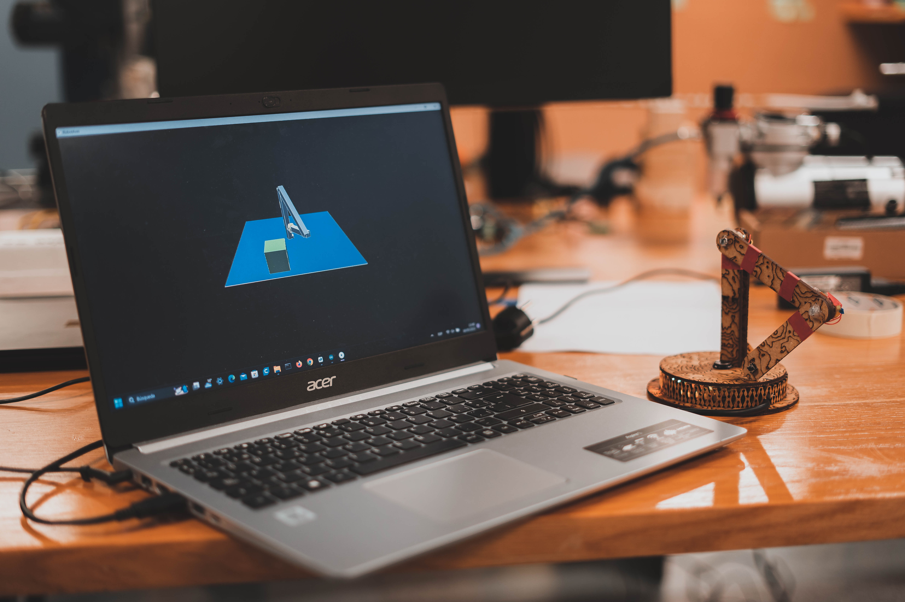

# ROBOARM
Translating physical motion into digital reality

---

---

This project was designed to create a robotic arm that can be controlled using potentiometers. The physical robotic arm was replicated in real-time as a 3D virtual counterpart, enabling users to control the robotic arm remotely from anywhere.

## Project Description

The project's goal was to explore the interaction between the physical and virtual worlds. To achieve this, we used Arduino to control the physical robotic arm and Processing to create a virtual 3D representation of the arm. Potentiometers were used as control interfaces to intuitively move the robotic arm.

## Applications

This project had exciting applications in telepresence and robotics learning. Some of the potential applications included:

- Remote control of a robotic arm in a physical environment from anywhere in the world.
- Use as a learning tool for robotics students to grasp concepts of robot control and programming.
- Exploration of the interaction between the physical and virtual worlds in the field of robotics.

## Link to Video

You can watch a demonstration of the project in action in this video. (Click on the image)

---

Created by Igor Vons , Odei Tarragona and Endika Aguirre 2023
